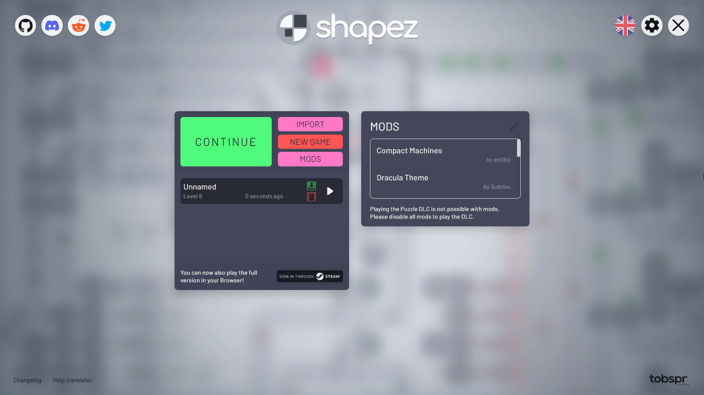

# Dracula for [Shapez](https://store.steampowered.com/app/1318690/shapez/)

> A dark theme for [Shapez](https://store.steampowered.com/app/1318690/shapez/).

## Install

All instructions can be found at [draculatheme.com/shapez](https://draculatheme.com/shapez).

## Team

This theme is maintained by the following person(s) and a bunch of [awesome contributors](https://github.com/dracula/foobar/graphs/contributors).

|  |  |
| ---------------------------------------------------------------------------------------- | --------------------------------------------------------------------------------------------- |
| [Dominic Hock](https://github.com/subtixx)                                               | [Lucas de França](https://github.com/luxonauta)                                               |

## Community

- [Twitter](https://twitter.com/draculatheme) - Best for getting updates about themes and new stuff.
- [GitHub](https://github.com/dracula/dracula-theme/discussions) - Best for asking questions and discussing issues.
- [Discord](https://draculatheme.com/discord-invite) - Best for hanging out with the community.

## License

[MIT License](./LICENSE)
